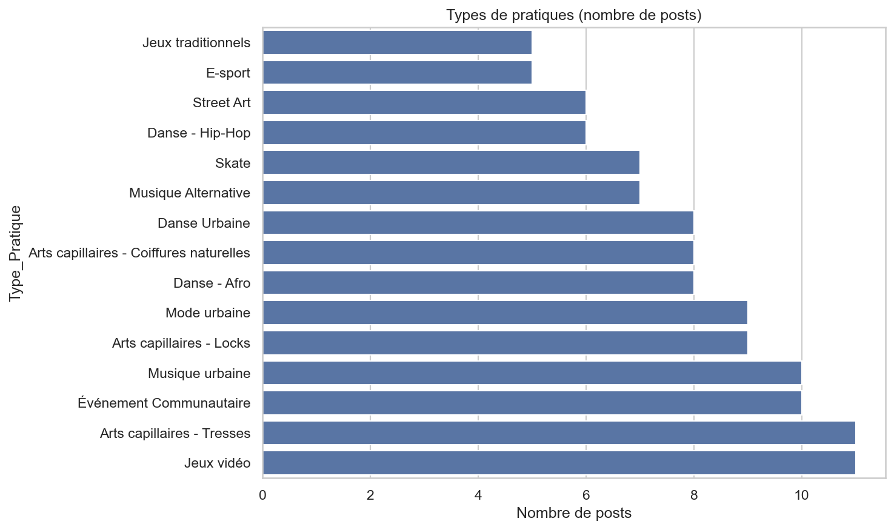
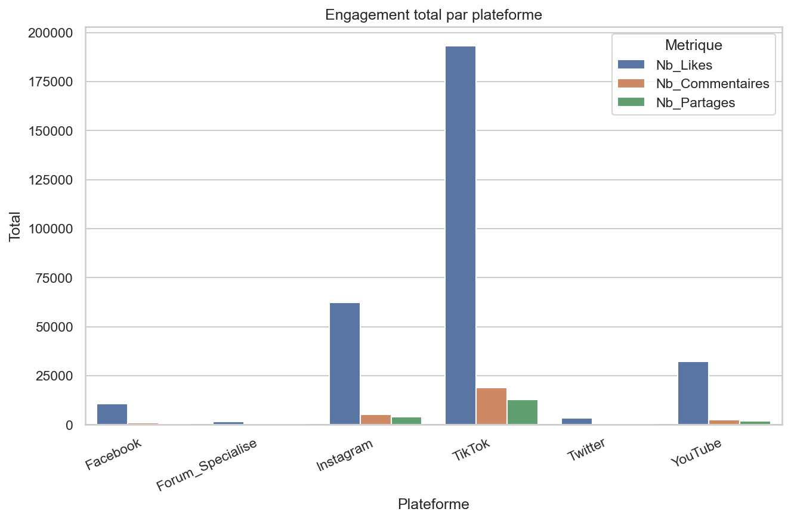
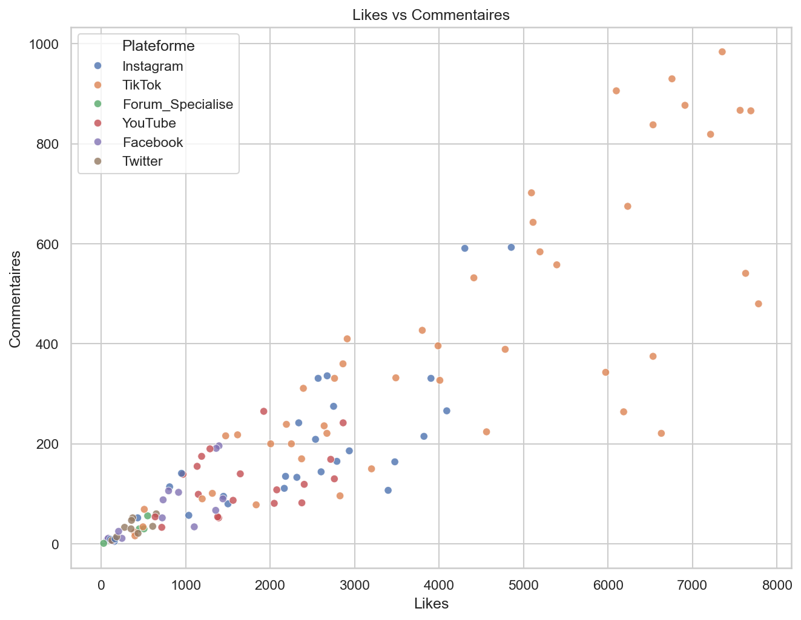
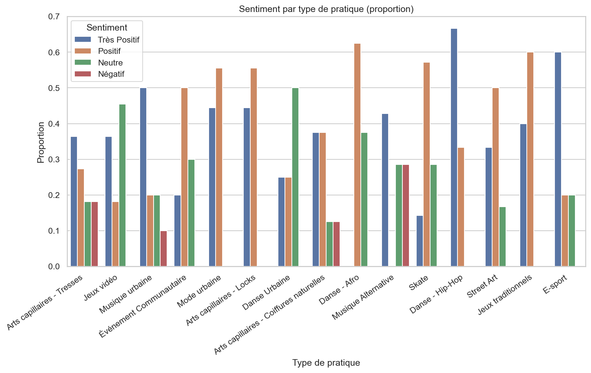
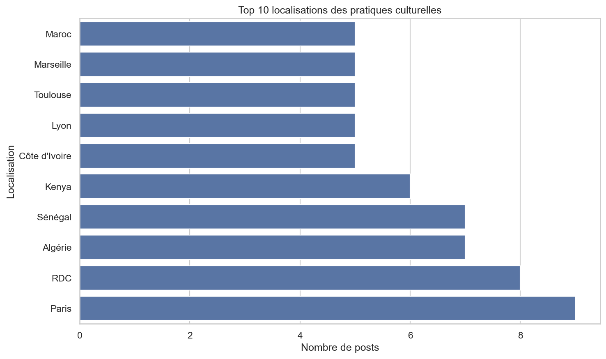

## Urban Data Explorer – Analyse des Pratiques urbaines

Mini-projet d’exploration de données avec **pandas** + **seaborn**.  
Objectif : produire **5 graphiques simples** et reproductibles pour raconter la donnée.

Ce rapport présente une exploration de données fictives sur les pratiques culturelles urbaines en ligne. Il illustre une démarche fondée sur des données fictives pour comprendre leur visibilité, leur engagement et leur perception.

---
#### 🚀 Aperçu  des résultats

<table>
  <tr>
    <td></td>
    <td></td>
  </tr>
  <tr>
    <td></td>
    <td></td>
  </tr>
  <tr>
  <td></td>
  </tr>
</table>

> Les graphiques sont générés par le notebook Jupyter. Si les images n'apparaissent pas, exécutez le notebook pour les créer.: ouvrez le notebook et lancez **Run All** (voir ci-dessous).


#### 💻 Comment l'utiliser ?

```bash
1. Ouvrez le notebook `notebooks/analyse_epure.ipynb` dans un environnement Jupyter (comme VS Code) et exécutez toutes les cellules 
- VS Code → `notebooks/analyse_epure.ipynb` → **Run All**  
2.  Le script générera automatiquement les 4 graphiques et les enregistrera dans le dossier `assets/`.

# Les 5 images sont enregistrées automatiquement dans **`assets/`** :
- `assets/1_types.png`
- `assets/2_plateformes.png...`

```

#### 🗂️ Structure du projet

```
Urban Data Explorer/
├─ README.md
├─ requirements.txt
├─ assets/
│  └─ (images générées)
└─ notebooks/
   ├─ analyse_epure.ipynb
   └─ data_urbaines_fictives.csv
```
---

#### 📊 Ce que montrent les 5 graphiques

1. **Répartition des pratiques** : quelles catégories publient le plus.  
2. **Engagement par plateforme** : où se concentrent likes / commentaires / partages.
3. **Corrélation likes ↔ commentaires** : relation visuelle entre les deux métriques.  
4. **Sentiment par type** : *Très Positif / Positif / Neutre / Négatif*.  
5. **Top 10 des localisations (villes)** : où l’activité est la plus présente.

>    Insights observés :

> - *TikTok concentre une grande part de l’engagement.* 
> - *Cette plateforme est particulièrement efficace pour la diffusion virale de contenus liés à ces pratiques.*
> - *Deux pratiques dominent en volume (ex. Jeux vidéo, Tresses).*  
> - *Likes et commentaires progressent ensemble (corrélation visible).*  
> - *Le sentiment est globalement positif.*  
> - *Paris/RDC (Algérie et Sénégal) figurent dans le Top 10 des localisations.*
> - *Ces villes apparaissent comme des centres majeurs pour ces pratiques.*
> - *Analyse géographique utile pour identifier les pôles d'activité et les zones où ces cultures sont les plus dynamiques.*

---

#### 🧰 Fichiers clés

- `notebooks/analyse_epure.ipynb` — notebook principal (lecture CSV + 4 graphes).  
- `requirements.txt` — dépendances minimales :
  ```
  pandas
  seaborn
  matplotlib
  jupyter
  ```

---

#### 🤝 Contribution

- 🐛 **Un bug ?** Ouvrez une "Issue"
- 💡 **Une idée ?** Proposez une amélioration
- ⭐ **Ça vous plaît ?** Mettez une étoile !

---

#### 👤 Auteur 

 **Nathan ZOUHOU**  GitHub: [@InsedayZ](https://github.com/InsedayZ)


